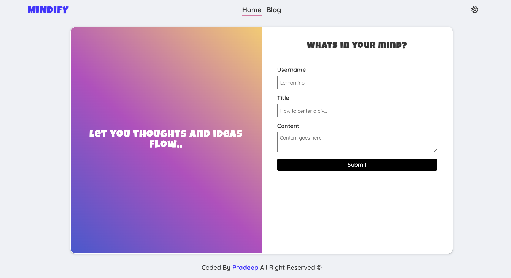
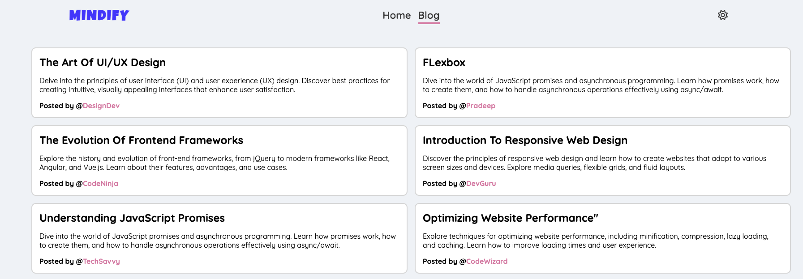
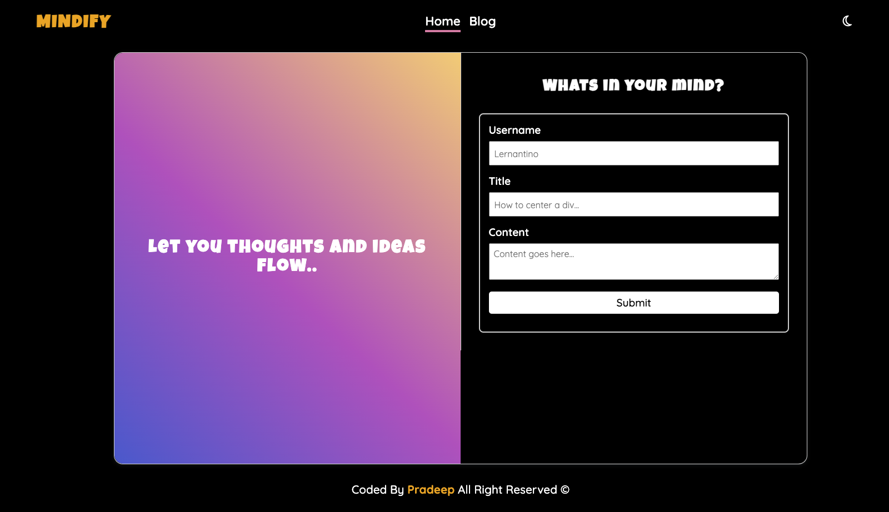
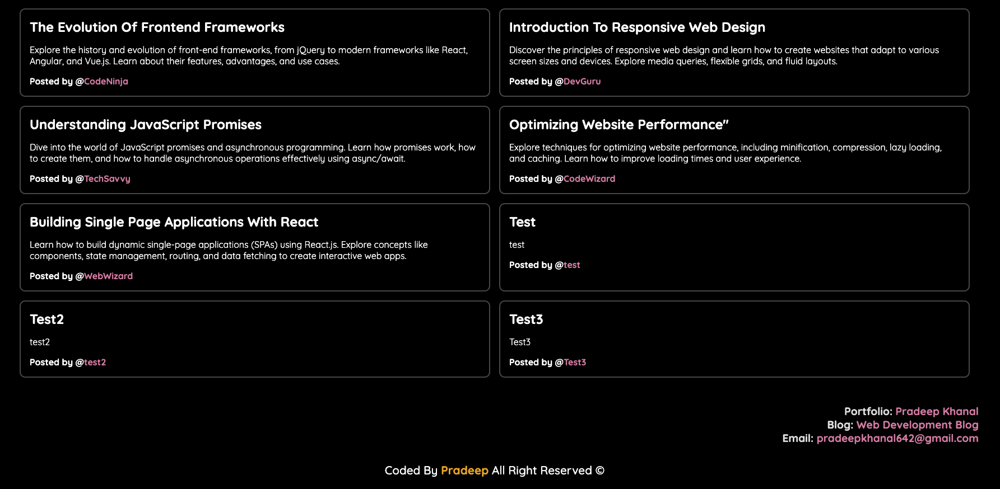

# Personal Blog

Welcome to my personal blog website.

## Description

The Blog App is a web application that allows users to create and read blog posts. It provides a simple interface for users to submit their blogs via form submission, which are then stored locally using browser storage. The app also features a toggleable dark mode theme, providing users with a personalized browsing experience.

The key features of the Blog App include:

- Creation of new blog posts with a username, title, and content.
- Displaying submitted blogs on the blog page.
- Toggling between light mode and dark mode for better readability.

## Table of Contents

- [Installation](#installation)
- [Usage](#usage)
- [Demo](#demo)
- [Screenshots](#screenshots)
- [License](#license)
- [Contributing](#contributing)

## Installation

To run the Blog App locally, follow these steps:

1. Clone the repository to your local machine.
2. Open the `index.html` file in your preferred web browser.

## Usage

Once the Blog App is running, you can perform the following actions:

- Fill out the form to create a new blog post.
- Click the theme switcher icon to toggle between light mode and dark mode.

## Demo

A live demo of the Blog App is available here in [github pages](https://pradeepkhanal23.github.io/my-blog-website/).

## Screenshots

### Light Mode

_Description: Main page of my blog website in light mode._

### Light Mode

_Description: Blog page of my blog website in light mode._

### Dark Mode

_Description: Main page of my blog website in dark mode._

### Dark Mode

_Description: Blog page of my blog website in dark mode._

## License

This project is licensed under the [MIT License](https://opensource.org/licenses/MIT). See the [LICENSE](LICENSE) file for details.

## Contributing

Contributions to the Blog App are welcome! Feel free to open an issue or submit a pull request with your enhancements or bug fixes.
